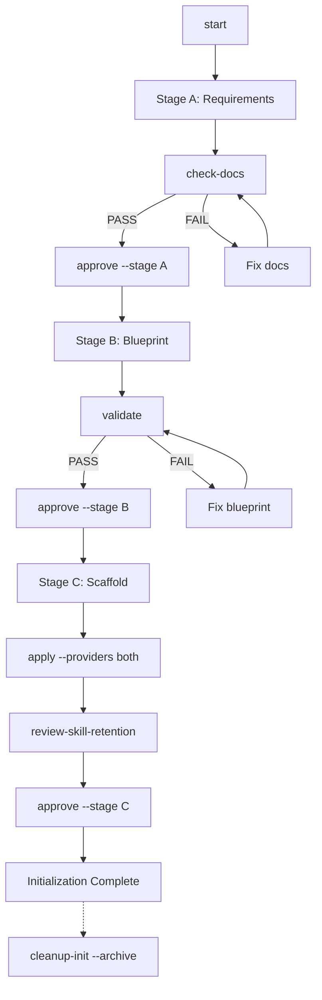

# Project Initialization

> Human-facing documentation. If you are an LLM/AI assistant, skip this file to save tokens and follow `init/AGENTS.md` instead.

A **3-stage, verifiable** pipeline for initializing projects from requirements.

## Command Shortcut

Use `node init/_tools/init.mjs <cmd>` instead of the full path:

```bash
# Short form (recommended)
node init/_tools/init.mjs start
node init/_tools/init.mjs check-docs
node init/_tools/init.mjs apply --providers both

# Full path (equivalent)
node init/_tools/skills/initialize-project-from-requirements/scripts/init-pipeline.mjs <cmd>
```

## Start Here

- Intake doc (generated on `start`; LLM-maintained blocks): `init/START-HERE.md`
- Generated board (generated on `start`): `init/INIT-BOARD.md`
- Manual refresh: `node init/_tools/init.mjs update-board --apply`

| Stage | Output | Verification |
|-------|--------|--------------|
| **A** | Requirement docs in `init/_work/stage-a-docs/` | `check-docs` |
| **B** | Blueprint at `init/_work/project-blueprint.json` | `validate` |
| **C** | Scaffold + skill wrappers | `apply` |

### Flow Diagram



## Quick Start

### AI-assisted (recommended)

Ask your LLM to follow `init/AGENTS.md`.

### Manual

```bash
# 1. Initialize templates and state
node init/_tools/init.mjs start

# 2. Edit Stage A docs, then validate
node init/_tools/init.mjs check-docs

# 3. Approve Stage A
node init/_tools/init.mjs approve --stage A

# 4. Edit blueprint, then validate
node init/_tools/init.mjs validate

# 5. Approve Stage B
node init/_tools/init.mjs approve --stage B

# 6. Apply scaffold and wrappers
node init/_tools/init.mjs apply --providers both

# 7. Review skill retention (required before Stage C approval)
node init/_tools/init.mjs review-skill-retention

# 8. (Optional) Re-generate root README.md + AGENTS.md from blueprint
node init/_tools/init.mjs update-root-docs --apply

# 9. Complete initialization
node init/_tools/init.mjs approve --stage C
```

## Documentation

| File | Purpose |
|------|---------|
| `_tools/init.mjs` | Command shortcut (use instead of full path) |
| `_work/` | Init workspace: state + Stage A docs + blueprint |
| `_tools/` | Init tools: pipeline + templates + checklists |
| `START-HERE.md` | Intake doc (LLM-maintained) |
| `INIT-BOARD.md` | Generated board (routing + kanban + digest) |
| `AGENTS.md` | LLM instructions |

## Migrating From Legacy Outputs

```bash
node init/_tools/init.mjs migrate-workdir --apply
```

## Post-init Cleanup

```bash
# Optional: remove agent-builder if not needed
node init/_tools/init.mjs prune-agent-builder --apply --i-understand

# Optional: archive and remove init kit
node init/_tools/init.mjs cleanup-init --apply --i-understand --archive
```

## Reference

### Conclusions (read first)

- Stage A produces **human-readable SSOT** for intent under `init/_work/stage-a-docs/` (archive to `docs/project/overview/` after init if needed; override with `--archive-dir`).
- Stage B produces **machine-readable SSOT** for automation: `init/_work/project-blueprint.json`.
- Stage C is deterministic:
  - scaffold directories based on `repo.layout` and enabled capabilities
  - update `.ai/skills/_meta/sync-manifest.json` (based on `skills.packs`)
  - regenerate provider wrappers by running `node .ai/scripts/sync-skills.mjs --scope current --providers both --mode reset --yes`
- The init kit is bootstrap-only. You may remove `init/` after success (guarded by `init/_tools/.init-kit`).

### 1. Definitions

- **Stage A (Requirements)**: docs defining scope, users, acceptance criteria, constraints, and non-goals.
- **Stage B (Blueprint)**: JSON decisions that drive scaffolding and skill selection deterministically.
- **Stage C (Scaffold + Skills)**: creates minimal directories, selects packs, and syncs wrappers.

### 2. Command Reference

All commands: `node init/_tools/init.mjs <cmd> [options]`

| Command | Purpose | Key Options |
|---------|---------|-------------|
| `start` | Initialize state + templates | |
| `status` | Show progress | |
| `check-docs` | Validate Stage A docs | `--strict` |
| `validate` | Validate blueprint | |
| `suggest-packs` | Recommend skill packs | `--write` |
| `approve` | Advance stage | `--stage A\|B\|C` |
| `scaffold` | Dry-run scaffold | |
| `apply` | Apply scaffold + wrappers | `--providers both`, `--skip-agent-builder` |
| `review-skill-retention` | Mark retention reviewed | |
| `update-root-docs` | Regenerate README/AGENTS | `--apply` |
| `prune-agent-builder` | Remove agent workflow | `--apply --i-understand` |
| `cleanup-init` | Remove init kit | `--apply --i-understand --archive` |
| `migrate-workdir` | Migrate legacy paths | `--apply` |
| `update-board` | Refresh INIT-BOARD.md | `--apply` |

For full option details, run: `node init/_tools/init.mjs --help`

### 3. Validation & Mapping

**`check-docs` validates:**
- Required files exist (4 docs in `stage-a-docs/`)
- Required headings present
- No template placeholders (`<name>`, `- ...`, `: ...`)

**`check-docs` does NOT validate:** business correctness, edge case coverage, or realistic NFR targets.

**Blueprint required fields:**
- `repo.layout`: `single` or `monorepo`
- `repo.language`: primary language
- `capabilities.frontend.enabled` / `capabilities.backend.enabled`
- `skills.packs`: include at least `["workflows"]` (and usually `["standards"]`)

### 4. Capabilities → Packs

| Signal | Suggested pack |
|--------|----------------|
| always | `workflows` |
| always (recommended) | `standards` |
| `capabilities.backend.enabled` | `backend` |
| `capabilities.frontend.enabled` | `frontend` |
| `quality.testing.enabled` | `testing` |

### 5. Cleanup safety

- Requires `init/_tools/.init-kit` marker
- Use `--archive` to copy to `docs/project/overview/` first
- Cross-platform: may rename to `.init-trash-<timestamp>` before deletion
